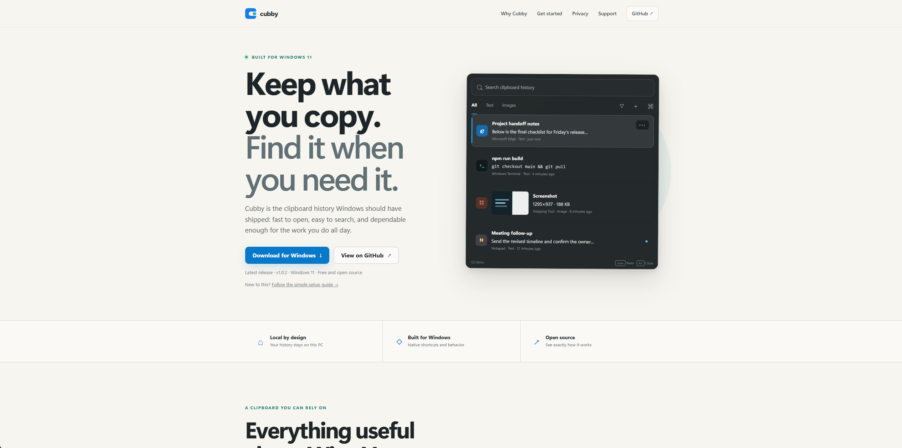
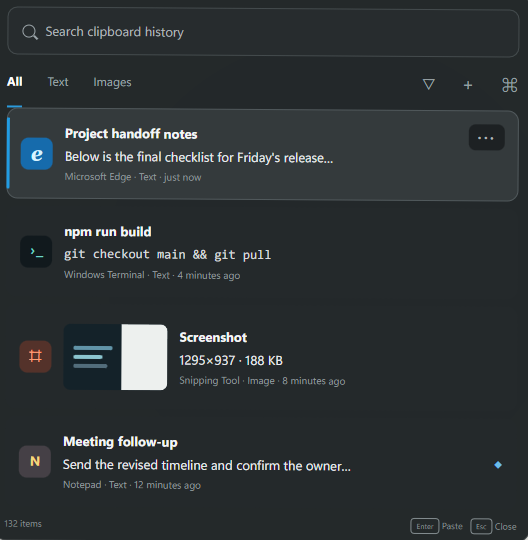

<div align="center">
  
  <h1>Cubby Clipboard</h1>
  <p><strong>Keep what you copy. Find it when you need it.</strong></p>
  <p>A fast, private clipboard history replacement built for Windows 11.</p>

  [](https://github.com/tsouth89/cubby-clipboard/releases/latest)
  [](https://github.com/tsouth89/cubby-clipboard/actions/workflows/ci.yml)
  [](https://cubbyclipboard.com/start.html)
  [](LICENSE)

  [Download](https://github.com/tsouth89/cubby-clipboard/releases/latest) · [Getting started](https://cubbyclipboard.com/start.html) · [Website](https://cubbyclipboard.com) · [Report an issue](https://github.com/tsouth89/cubby-clipboard/issues)
</div>



## Why Cubby?

Windows Clipboard History is convenient, but its short memory makes it hard to depend on. Cubby keeps the familiar `Win+V` workflow while adding persistent local history, instant search, rich clipboard formats, and controls for sensitive apps.

<p align="center">
  
</p>

| Built for everyday use | Private by design |
| --- | --- |
| Persistent history with fast text and screenshot search | No account, cloud sync, ads, or desktop analytics |
| Text, HTML, RTF, images, and file lists | AES-256-GCM encryption for stored clipboard payloads |
| Pinning, folders, filters, and per-app context | Encryption key protected for the current Windows user |
| Keyboard-first navigation and paste | Ignored-app and sensitive-content controls |
| Windows 11 flyout, tray, themes, and startup options | Open-source GPL-3.0 code |
| RDP and remote-support workflows | Signed updates from GitHub Releases |

## Install

Cubby supports Windows 11 on x64 and ARM64.

1. Download the installer for your PC from the [latest release](https://github.com/tsouth89/cubby-clipboard/releases/latest).
2. Run the `*-setup.exe` file. Windows may ask you to confirm the publisher during early releases.
3. Open Cubby from the tray, finish the short setup, then use `Win+V`.

The app checks for signed updates at startup and every 30 minutes while it is running. See the [beginner-friendly setup guide](https://cubbyclipboard.com/start.html) for screenshots and troubleshooting.

## Keyboard shortcuts

| Shortcut | Action |
| --- | --- |
| `Win+V` | Open or close Cubby |
| `Ctrl+F` | Focus search |
| `Up` / `Down` | Move through clips |
| `Enter` | Paste the selected clip |
| `Shift+Enter` | Paste as plain text, or paste recognized text from an image |
| `P` | Pin or unpin the selected clip |
| `Delete` | Delete the selected clip |
| `Escape` | Clear search or close Cubby |

## Privacy

Clipboard data stays on your PC. Cubby encrypts stored clipboard payloads and image data with AES-256-GCM, with the key protected by Windows for your user account. The desktop app contains no analytics or usage telemetry.

The app contacts GitHub to check for signed updates and opens links you request. The website uses limited, cookie-free first-party analytics; it does not receive clipboard content. Read the full [privacy policy](https://cubbyclipboard.com/privacy.html).

## Build from source

Requirements: Windows 11, Node.js, pnpm, Rust with the MSVC toolchain, Visual Studio C++ build tools, and WebView2.

```powershell
pnpm install --frozen-lockfile
pnpm run build

Push-Location src-tauri
cargo check --locked
cargo test --locked
Pop-Location

pnpm tauri dev
```

The React/TypeScript frontend lives in `frontend/`; Rust clipboard, storage, windowing, and IPC code lives in `src-tauri/`; the Cloudflare Pages website lives in `product_pages/`.

## Contributing

Bug reports, focused feature proposals, documentation fixes, and code contributions are welcome. Start with [CONTRIBUTING.md](CONTRIBUTING.md) and look for [`good first issue`](https://github.com/tsouth89/cubby-clipboard/labels/good%20first%20issue) or [`help wanted`](https://github.com/tsouth89/cubby-clipboard/labels/help%20wanted).

Cubby is Windows-only. Please do not add macOS or Linux product work.

## License and attribution

Cubby Clipboard is licensed under [GPL-3.0](LICENSE). It began from the GPL-3.0 PastePaw codebase and preserves its original Git history, copyright, license, and contributor credit. See [NOTICE.md](NOTICE.md) for details.
